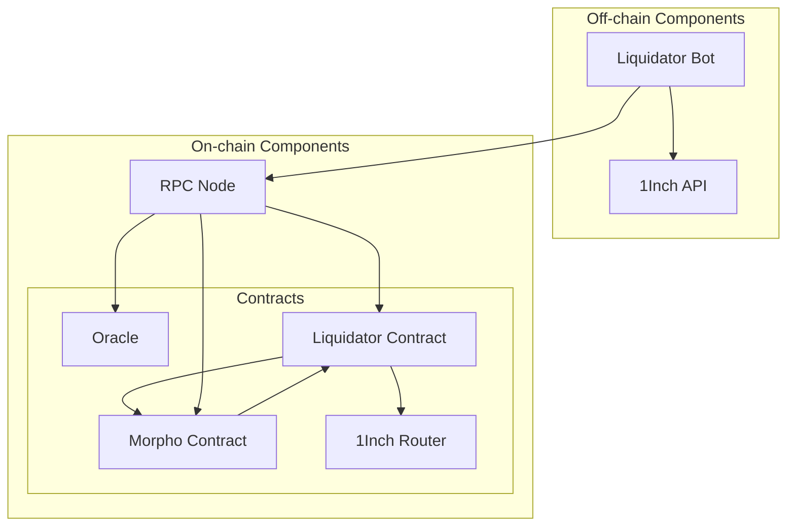
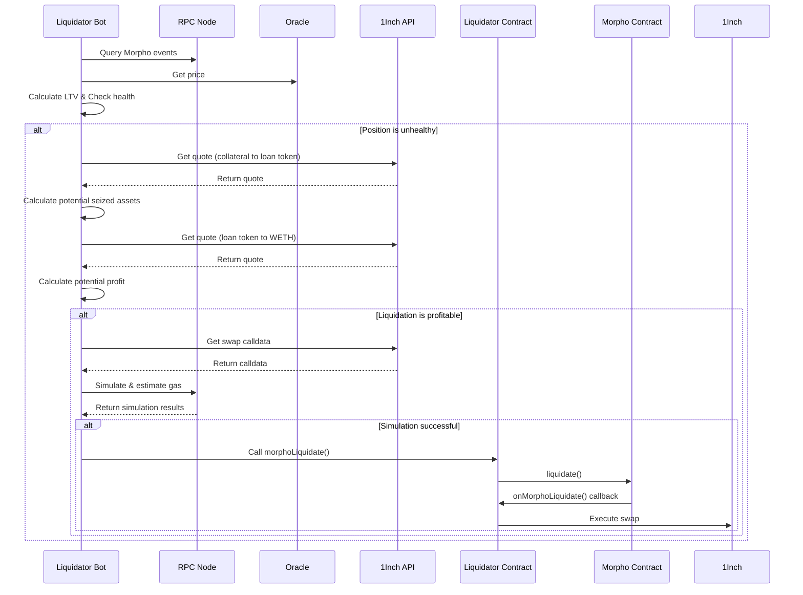

# Morpho Blue Liquidation Bot

- [Morpho Blue Liquidation Bot](#morpho-blue-liquidation-bot)
  - [1.1. Overview](#11-overview)
  - [1.2. System Architecture](#12-system-architecture)
  - [1.3. How It Works](#13-how-it-works)
  - [1.4. Key Components](#14-key-components)
    - [1.4.1. Liquidator Bot](#141-liquidator-bot)
    - [1.4.2. Liquidator Contract](#142-liquidator-contract)
  - [1.5. Configuration](#15-configuration)
  - [1.6. Usage](#16-usage)
  - [1.7. Known Issues and Limitations](#17-known-issues-and-limitations)
  - [1.8. Potential Improvements](#18-potential-improvements)
  - [1.9. References](#19-references)

## 1.1. Overview

This liquidation bot is designed to monitor and liquidate unhealthy positions on the Morpho Blue lending protocol. It utilizes various components to identify liquidation opportunities, calculate profitability, and execute liquidations when profitable.

## 1.2. System Architecture

The system consists of the following components:

1. **Liquidator Bot**: The core off-chain component that orchestrates the liquidation process. Indexes and stores relevant events from the Morpho contract for efficient querying.
2. **RPC Node**: Provides access to the Ethereum network for querying and transaction submission.
3. **Oracle**: Supplies price data for collateral and loan tokens.
4. **1Inch API**: Provides price quotes and swap calldata for token exchanges.
5. **Liquidator Contract**: Smart contract that interacts with Morpho and executes the liquidation.
6. **Morpho Contract**: The main contract of the Morpho protocol.
7. **1Inch Router**: On-chain component for executing token swaps.

## 1.3. How It Works

The liquidation process follows these steps:

1. **Monitoring**: The bot queries the RPC Node for Morpho events and processes them to identify potential liquidation opportunities.

2. **Health Check**: For each position, the bot:

   - Retrieves the current price from the Oracle.
   - Calculates the Loan-to-Value (LTV) ratio.
   - Checks if the position is unhealthy (LTV > Liquidation LTV).

3. **Profitability Calculation**: If a position is unhealthy, the bot:

   - Requests a quote from 1Inch API for swapping collateral to loan token.
   - Calculates the potential seized assets.
   - Requests another quote from 1Inch API for swapping loan token to WETH.
   - Calculates the potential profit based on these quotes.

4. **Liquidation Execution**: If the liquidation is deemed profitable, the bot:

   - Retrieves swap calldata from 1Inch API.
   - Simulates the transaction and estimates gas costs using the RPC Node.
   - If the simulation is successful, it calls the `morphoLiquidate()` function on the Liquidator Contract.

5. **On-chain Execution**: The Liquidator Contract:
   - Calls the `liquidate()` function on the Morpho Contract.
   - Receives a callback (`onMorphoLiquidate()`) from Morpho.
   - Executes the token swap using the 1Inch Router.

## 1.4. Key Components

### 1.4.1. Liquidator Bot

The main application that coordinates the entire process. it indexes on chain Morpho event to be able to have a quick off chain processing. It's responsible for:

- Monitoring Morpho positions
- Performing health checks
- Calculating profitability
- Initiating liquidations

### 1.4.2. Liquidator Contract

A smart contract that acts as an intermediary between the bot and the Morpho protocol. It:

- Receives liquidation instructions from the bot
- Interacts with the Morpho contract to perform liquidations
- Handles callbacks from Morpho
- Executes token swaps via 1Inch

## 1.5. Configuration

The bot requires several configuration parameters:

- `ARCHIVE_URL`: The URL of the Subsquid archive node
- `START_BLOCK`: The block number from which to start indexing events
- `RPC_ETH_HTTP`: The Ethereum RPC endpoint
- `EXECUTOR_PK`: The private key for transaction execution
- `ONEINCH_API_KEY`: The API key for the 1Inch API
- `CHAIN_ID`: The Ethereum chain ID

## 1.6. Usage

To run the bot:

1. Ensure all dependencies are installed: `npm install`
2. Set up the configuration in a `.env` file
3. Run the bot: `npm run dev`

## 1.7. Known Issues and Limitations

- The bot is not yet fully tested and may contain bugs.
- The Liquidator Contract is not deployed on the Ethereum mainnet
- Calculations regarding profit and LTV may not be accurate

## 1.8. Potential Improvements

- Limit the reliance on RPC queries
  - Index oracle price updates instead of querying the oracle contract
- Limit the reliance on 1Inch API
- Improve the Liquidator Contract to add more functionalities such as a better integration with Morpho and DEX
- Pre-index known assets and positions to speed up the bot
- Migrate calculations on chain for better precision
- Index bot liquidations to improve the bot's decision-making, performances, and profitability

## 1.9. References

This bot was built getting inspiration from the following repositories:

- [morpho-org/morpho-blue-snippets](https://github.com/morpho-org/morpho-blue-snippets/blob/main/src/morpho-blue/LiquidationSnippets.sol)
- [morpho-org/morpho-positions-indexer-subgraph](https://github.com/morpho-org/morpho-positions-indexer-subgraph/blob/main/src/morpho.ts)
- [zach030/morpho-liquidator-bot](https://github.com/zach030/morpho-liquidator-bot/tree/master)
- [etherhood/Liquidator-Morpho](https://github.com/etherhood/Liquidator-Morpho/tree/master)
